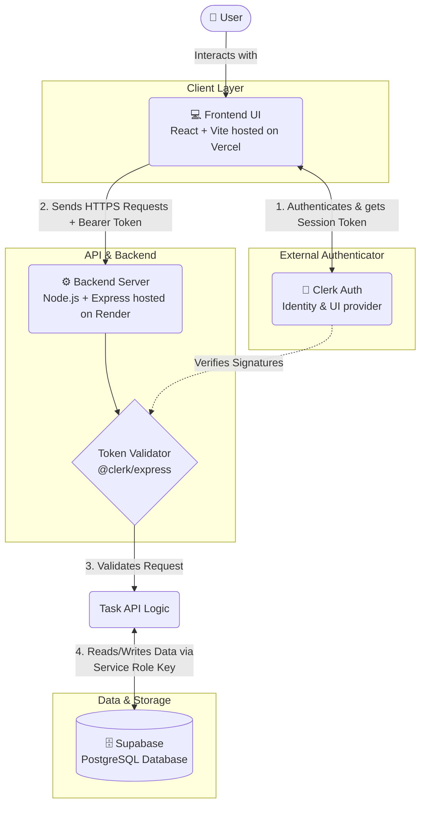

# Task App: Architectural Overview

This document provides a highly simplified, structural breakdown of the modern, decoupled To-Do list web application.

## 🏗️ High-Level Architecture Diagram

---

## 🛠️ Technology Stack & Responsibilities

### 1. Frontend Client (Vercel)
* **Tech:** React, Vite
* **Location:** `https://task-app-olive-ten.vercel.app`
* **Role:** The entry point for the user. 
* **Details:** This interface uses the `@clerk/clerk-react` library natively. When users attempt to interact with tasks, it securely fetches a JSON Web Token (JWT) representing their session from Clerk, and injects it into API requests directed to the backend.

### 2. Authentication Provider (Clerk)
* **Tech:** Clerk 
* **Role:** Identity management platform.
* **Details:** Eliminates the need to build a custom login system. It serves secure login portals, manages passwords, handles multi-factor authentication, and issues cryptographically signed session tokens confirming the user's identity.

### 3. Backend API Server (Render)
* **Tech:** Node.js, Express
* **Location:** `https://taskapp-u5ka.onrender.com`
* **Role:** The secure, intermediary orchestrator. 
* **Details:** Built to host RESTful API endpoints (`GET /tasks`, `POST /tasks`, etc.). First, it uses an authentication middleware to verify the Clerk signature on the frontend's tokens. Once the identity is proven, the server acts on those instructions. A strict CORS configuration ensures it ONLY talks to your specific Vercel URL.

### 4. Database (Supabase)
* **Tech:** PostgreSQL database managed by Supabase
* **Role:** Persistent data storage.
* **Details:** Holds a `tasks` table containing the task descriptions, completion states, and a reference column (`user_id`) identifying exactly which Clerk user owns the task.
* **Security:** While Supabase offers client-side Row-Level Security (RLS), this architecture opts for server-side authority. The Node.js backend utilizes a `SUPABASE_SERVICE_ROLE_KEY` to securely bypass row limits, ensuring that the backend alone validates permissions before persisting data.

---

## 🔄 The Data Lifecycle: Creating a Task
To visualize how the architecture functions, here's what happens when you click "Add" on a new task:

1. **User Action**: You type a task and click submit on the *Vercel Frontend*.
2. **Retrieve Auth**: The frontend silently asks *Clerk* "give me proof this user is logged in," and receives a token.
3. **Dispatch Request**: The frontend makes an HTTP `POST` request to the *Render Backend*, passing the new task and the token.
4. **Server Validation**: The backend intercepts the request and verifies the token. If genuine, it extracts the user's ID.
5. **Database Interaction**: The backend takes the user ID and task details, uses its secret Admin "Service Role Key", and securely commands the *Supabase* database to insert a new row.
6. **Return Route**: Supabase confirms the save; the Node.js server returns a `201 Created` successful status code back to Vercel, and your UI updates to show the live task.
